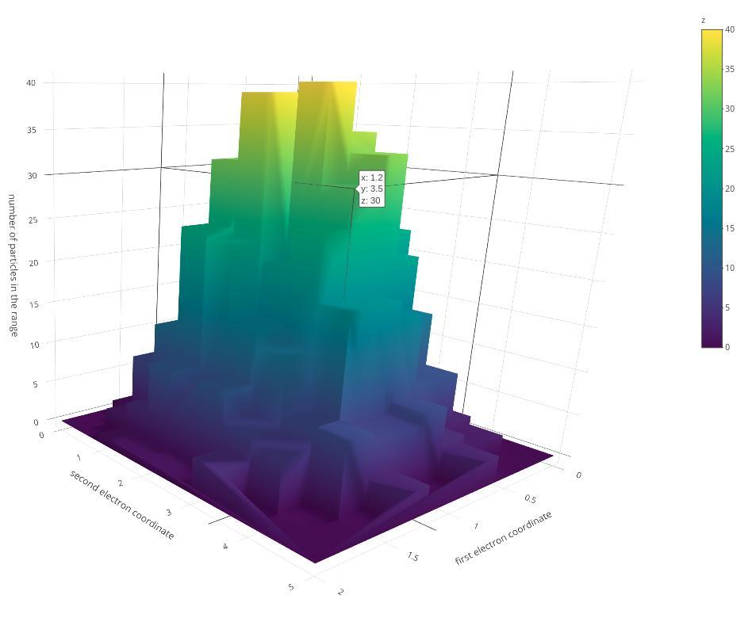
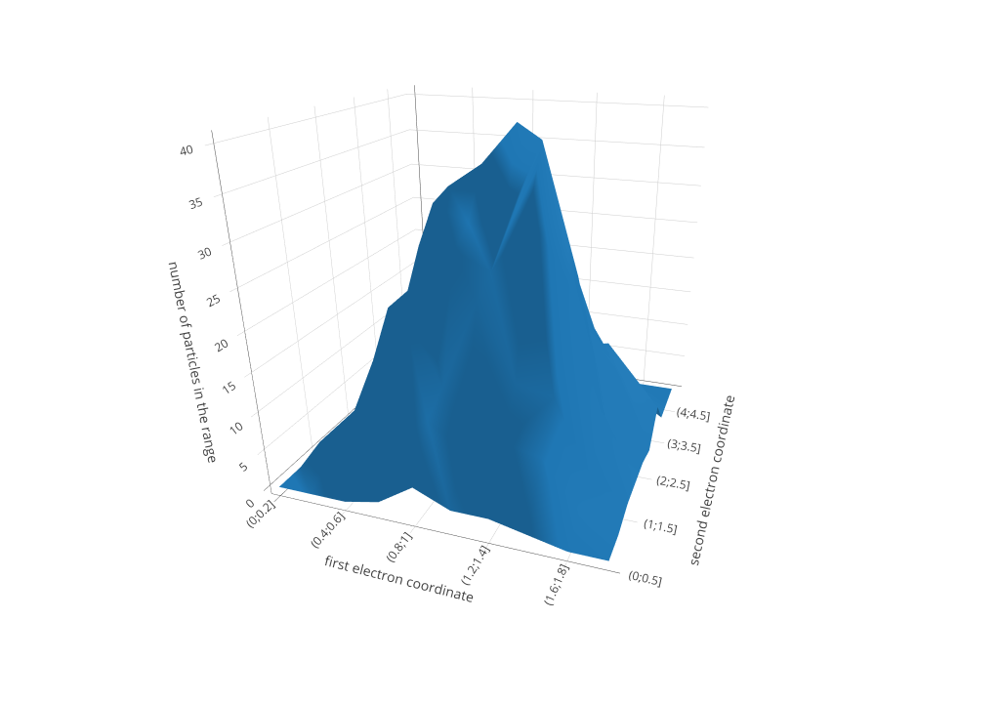
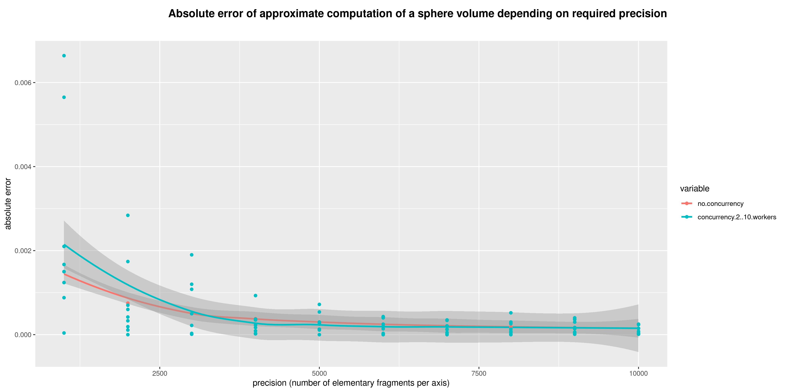

# river

**R** **vi**sualiz**er** - a convenient tool for bringing the power and beauty of plotting facilities implemented in the R language libraries to your data

## Usage

Example of usage:

```sh
./source/main.r corpora/experiment
```

The command accepts two arguments - the first points to the folder with corpus data (the directory must contain at least two files - one with extension `yml` which declares desired plot properties and some corpus metadata and other contains the corpus data itself in the `tsv` format). The second parameter provides a path to the folder with images (may be omitted, by default this value is taken to be equal to `images`).

For the command above after the script execution a file with name `images/experiment.jpeg` will be generated.

At the same time the project is very easy to use from the R console as well which is a preferable option when working with interactive plotly diagrams. As you can see in the example below, a corpus can be easily imported and visualized using just one short expression.

```r
source('source/utils.r')
'corpora/2d-electron-positions` %>% read %>% render
```

And if you want to save the generated image on a disk to make it a static asset, it's extremely simple as well

```r
source('source/utils.r')
'corpora/2d-electron-positions` %>% read %>% render %>% draw("image.jpeg")
```

## Prerequisities

The following instructions, commands and scripts are tested solely on Ubuntu 20.04. The installation must be executed only after setting your working directory to match the folder containing data from this repository.

1. Installing R itself 

```sh
sudo apt update -qq
sudo apt install --no-install-recommends software-properties-common dirmngr
wget -qO- https://cloud.r-project.org/bin/linux/ubuntu/marutter_pubkey.asc | sudo tee -a /etc/apt/trusted.gpg.d/cran_ubuntu_key.asc
sudo add-apt-repository "deb https://cloud.r-project.org/bin/linux/ubuntu $(lsb_release -cs)-cran40/"
```
2. Installing system-level dependencies
```sh
sudo apt-get update && sudo apt-get install libcairo2-dev -y # required for installing hrbrthemes on ubuntu, for other OSes there must be analogous packages
conda install -c plotly plotly-orca # required for exporting images generated via plotly (currently this impacts 3d histograms)
```
3. Installing R dependencies
```sh
./setup.sh # No output or messages saying that some packages were skipped mean that all required libraries are already installed
```

## Examples







